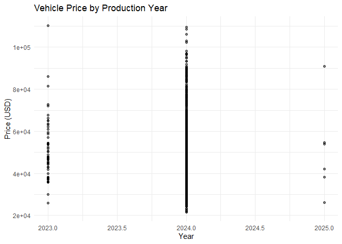

This README includes: - **Package Overview**: A description of
`AutoPrice` and its main features. - **Installation Instructions**: How
to install the package from GitHub. - **Example Usage**: Loading the
dataset, conducting basic analysis, and generating summary statistics. -
**Shiny App Instructions**: How to start and use the Shiny app. -
**Contributing and License**: Information on contributing to the package
and licensing.

<!-- README.md is generated from README.Rmd. Please edit that file -->

# AutoPrice

<!-- badges: start -->
<!-- badges: end -->

The AutoPrice package provides tools for analyzing vehicle price trends
across production years, vehicle makes, models, and more. This package
is designed to support data-driven insights in the automotive industry,
focusing on price changes from 2023 to 2025 to help users understand the
factors driving price fluctuations.

# Key Features

Dataset Access: A cleaned dataset (vehicles_clean) with over 9,000
vehicles, covering essential details like price, year, make, model, fuel
type, mileage, transmission, and body type. Shiny App: An interactive
Shiny app that allows users to explore vehicle price distributions,
filter data by various attributes, and download the filtered results.
Data Analysis Tools: Functions for analyzing price trends by production
year, vehicle make, and other attributes.

## Installation

You can install the development version of AutoPrice from
[GitHub](https://github.com/) with:

``` r
install.packages("remotes")
remotes::install_github("richisusiljacob/AutoPrice")
```

# Getting Started

## Loading the Dataset

The primary dataset, vehicles_clean, can be accessed directly from the
package. This dataset includes vehicles manufactured from 2023 to 2025,
with fields such as price, year, make, model, and fuel.

``` r
library(AutoPrice)

# Load the vehicle price data
data("vehicles_clean")
head(vehicles_clean)
#>                              name
#> 1    2024 Jeep Wagoneer Series II
#> 2 2024 Jeep Grand Cherokee Laredo
#> 3        2024 GMC Yukon XL Denali
#> 4      2023 Dodge Durango Pursuit
#> 5           2024 RAM 3500 Laramie
#> 6     2024 Nissan Murano Platinum
#>                                                                                                                                                                                                                                                                                                                                                                                                                                                                                                                                                                                                                                                                                                                                                                                                                                                                                                                                                                                                                                                                                                                                                                                                                                                                                                                                                                                                                                                                                                                                                                                                                                                                                                                                                                                                                                                                                                                                                                                                                                                                                                                                                                               description
#> 1                                                                                                                                                                                                                                                                                                                                                                                                                                                                \n      \n        Heated Leather Seats, Nav System, Moonroof, Third Row Seat, 4x4, Turbo Charged Engine, Hitch, ENGINE: 3.0L I6 HURRICANE SO TWIN TUR... Quad Bucket Seats. Series II Carbide trim, Bright White Clearcoat exterior and Global Black interior KEY FEATURES INCLUDELeather Seats, Navigation, 4x4, Power Liftgate, Rear Air OPTION PACKAGESQUICK ORDER PACKAGE 25F CARBIDE Engine: 3.0L I6 Hurricane SO Twin Turbo ESS, Transmission: 8-Speed Automatic (8HP75), Reversible Carpet/Vinyl Cargo Mat, Cargo Cover, Black Interior Accents, Carbide Appearance Package, 3 Panel Sunroof, Adjustable Roof Rail Crossbars, Piano Black Exterior Accents, HD TRAILER TOW PACKAGE Trailer Brake Control, Heavy Duty Engine Cooling, Electronic Rear Limited Slip Differential, Black Tow Hooks, Removable Rear Tow Hook, Trailer Hitch Zoom, 2 Speed On Demand Transfer Case, Wheels: 22 x 9.0 Painted Gloss Black, 3.92 Rear Axle Ratio, Selec-Speed Control, FLEXIBLE SEATING GROUP 60/40 Power Recline 3rd Row Seat, Power Tip/Slide Recline 2nd Row Buckets, 7 Passenger Seating, Floor Console w/Cupholder, TRANSMISSION: 8-SPEED AUTOMATIC (8HP75) (STD), ENGINE: 3.0L I6 HURRICANE SO TWIN TURBO ESS (STD). OUR OFFERINGSOur team has been serving our hometown of Rockwall, along with the communities of Terrell, Rowlett, Wylie and others for a long timelonger than many of you might have owned your current car, in fact. With those years of experience comes expertise in auto sales, finance and maintenance, which we put to your advantage. Were excited to show you how! Please confirm the accuracy of the included equipment by calling us prior to purchase. \n      \n    Shop The Rock!
#> 2                                                                                                                                                                                                                                                                                                                                                                                                                                                                                                                                                                                                                                                                                                                                                                                                                                                                                                                                                                                                                                                                                                                                                                                                                                                                                                                                                                                                                                                                                                                                                                                                                                                                                                                                                                                                                                                                                                                                      Al West is committed to offering every customer up-front value pricing, in-depth vehicle history reports, and limited warranties on every vehicle we sell. Al West has been locally family owned and operated since 1969 and has an A+ BBB rating.
#> 3                                                                                                                                                                                                                                                                                                                                                                                                                                                                                                                                                                                                                                                                                                                                                                                                                                                                                                                                                                                                                                                                                                                                                                                                                                                                                                                                                                                                                                                                                                                                                                                                                                                                                                                                                                                                                                                                                                                                                                                                                                                                                                                                                                                    <NA>
#> 4                                                                                                                                                                                                                                                                                                                                                                                                                                                                                                                                                                                                                                                                                                                                                                                                                                                                                                                                                                                                                                                                                                                                                                                                                                                                                                                                                                                                                                                                                                                                                                                                                                                                                                                                                                                                                                                                                                                                                                                                                                                                            White Knuckle Clearcoat 2023 Dodge Durango Pursuit AWD 8-Speed Automatic HEMI 5.7L V8 Multi Displacement VVT
#> 5 \n      \n        2024 Ram 3500 Laramie Billet Silver Metallic Clearcoat 4WD Aisin 6-Speed Automatic I6 Here at Silverthorne Ford Chrysler Jeep Dodge Ram we have been family owned for more than 10 years. We proudly serve the Robinson IL community, we also serve Terre Haute and all surrounding areas. We offer Contactless purchase, Virtual appointments, Private dealer appointments, Free home drop-off, and Free test drive at home within 25 miles of our dealership. Please Contact us at (618) 546-5440 to schedule the appointment option of your choice. We have a strong and committed sales staff with many years of experience in satisfying our customers' needs. Chrome Bumper Package (Bright Rear Bumper), Laramie Level B Equipment Group (18' x 8' Polished Aluminum Wheels, 2nd Row In Floor Storage Bins, 4G LTE Wi-Fi Hot Spot, Alexa Built-In, Apple CarPlay, Auto Adjust In Reverse Exterior Mirrors, Blind Spot Cross Path Detection, Center Hub, Chrome Exterior Mirrors, Connected Travel Traffic Services, Connectivity - US/Canada, Disassociated Touchscreen Display, Exterior Mirrors Courtesy Lamps, Exterior Mirrors w/Heating Element, Exterior Mirrors w/Supplemental Signals, Foam Bottle Insert (Door Trim Panel), For Details Visit DriveUconnect.com, For More Info, Call 800-643-2112, Global Telematics Box Module (TBM), Google Android Auto, GPS Antenna Input, GPS Navigation, HD Radio, Heated Second Row Seats, Integrated Voice Command w/Bluetooth, Off-Road Information Pages, Power Adjust Mirrors, Power Telescoping Mirrors, Power-Adjustable Convex Aux Mirrors, Radio: Uconnect 5 Nav w/12.0' Display, Rain Sensitive Windshield Wipers, Rear Window Defroster, Selectable Tire Fill Alert, SiriusXM Radio Service, SiriusXM w/360L, and Trailer Tow Pages), Quick Order Package 21H Laramie, 10 Speakers, 115V Auxiliary Rear Power Outlet, 2 Way Rear Headrest Seat, 220 Amp Alternator, 3.73 Axle Ratio, 4 Way Front Headrests, 4-Wheel Disc Brakes, 50 Gallon Fuel Tank, 5th Wheel/Gooseneck Towing Prep Group, 8.4' Touchscreen D\n      \n    Please visit our website for additional rebates and incentives offered.
#> 6                                                                                                                                                                                                                                                                                                                                                                                                                                                                                                                                                                                                                                                                                                                                                                                          \n      \n        Boasts 28 Highway MPG and 20 City MPG! This Nissan Murano delivers a Regular Unleaded V-6 3.5 L/213 engine powering this Variable transmission. PEARL WHITE TRICOAT, MOCHA, SEMI-ANILINE LEATHER-APPOINTED SEAT TRIM -inc: diamond-quilted inserts, [M92] CARGO PACKAGE -inc: Cargo Area Protector, Retractable Cargo Cover, Cargo Net, First Aid Kit. This Nissan Murano Comes Equipped with These Options [B93] REAR BUMPER PROTECTOR, [B92] SPLASH GUARDS (B92), Window Grid And Roof Mount Diversity Antenna, Wi-Fi Hotspot Selective Service Internet Access, Wheels: 20 Unique Dark Hyper Silver, Valet Function, Turn-By-Turn Navigation Directions, Trunk/Hatch Auto-Latch, Trip computer, Transmission: Xtronic Continuously Variable (CVT). Stop By Today Stop by Gates GMC Nissan Buick located at 143 Boston Post Rd, North Windham, CT 06256 for a quick visit and a great vehicle! - For more information on this or any other Gates GMC Nissan vehicle go to www.gatesgmcnissan.com.#gatesgetsit #wetakeanythingintrade #goatsboatstrainsplanes #2yrsfreemaintenance. Price includes all manufacturer rebates.\n      \n    Goats, Boats, Trains, and Planes. You Name It, We Will Trade It. Here at Gates GMC Buick Nissan and NV. First 4 Oil Changes are included with the purchase of any new and pre-owned vehicle. Give us a call today at 800-917-5916
#>     make          model type year price
#> 1   Jeep       Wagoneer  New 2024 74600
#> 2   Jeep Grand Cherokee  New 2024 50170
#> 3    GMC       Yukon XL  New 2024 96410
#> 4  Dodge        Durango  New 2023 46835
#> 5    RAM           3500  New 2024 81663
#> 6 Nissan         Murano  New 2024 46000
#>                                                     engine cylinders     fuel
#> 1                                  24V GDI DOHC Twin Turbo         6 Gasoline
#> 2                                                      OHV         6 Gasoline
#> 3 6.2L V-8 gasoline direct injection, variable valve contr         8 Gasoline
#> 4                                             16V MPFI OHV         8 Gasoline
#> 5                                 24V DDI OHV Turbo Diesel         6   Diesel
#> 6                                            24V MPFI DOHC         6 Gasoline
#>   mileage      transmission      trim         body doors
#> 1      10 8-Speed Automatic Series II          SUV     4
#> 2       1 8-Speed Automatic    Laredo          SUV     4
#> 3       0         Automatic    Denali          SUV     4
#> 4      32 8-Speed Automatic   Pursuit          SUV     4
#> 5      10 6-Speed Automatic   Laramie Pickup Truck     4
#> 6    3838     Automatic CVT  Platinum          SUV     4
#>            exterior_color   interior_color       drivetrain
#> 1                   White     Global Black Four-wheel Drive
#> 2                Metallic     Global Black Four-wheel Drive
#> 3            Summit White Teak/Light Shale Four-wheel Drive
#> 4 White Knuckle Clearcoat            Black  All-wheel Drive
#> 5                  Silver            Black Four-wheel Drive
#> 6                   White             Gray  All-wheel Drive
```

## Basic Analysis Example

Here’s a simple analysis that shows the distribution of vehicle prices
by year:

``` r
library(ggplot2)

ggplot(vehicles_clean, aes(x = year, y = price)) +
  geom_point(alpha = 0.5) +
  labs(title = "Vehicle Price by Production Year",
       x = "Year",
       y = "Price (USD)") +
  theme_minimal()
```



# Summary Statistics

You can also view basic summary statistics of the vehicle prices:

``` r
summary(vehicles_clean$price)
#>    Min. 1st Qu.  Median    Mean 3rd Qu.    Max. 
#>   21637   36891   47165   49734   58750  110150
```

# Shiny App

The AutoPrice package includes a Shiny app for interactive exploration
of the dataset. This app provides tools for filtering vehicle data by
year, price range, make, transmission type, and body type. The app
generates a histogram showing the distribution of prices based on these
filters, and users can download the filtered data.

## Running the Shiny App

To launch the Shiny app, use the following command:

``` r
AutoPrice::run_app()
```

Once the app is running, We can:

Filter data by year (2023, 2024, 2025), price range, make, transmission,
and body type. View a histogram of vehicle prices based on the selected
filters. Download the filtered dataset for further analysis.

# Contributing

We welcome contributions to enhance the functionality of AutoPrice. If
you’d like to contribute, please submit a pull request or open an issue
on GitHub.

# License

The AutoPrice package is licensed under the MIT License.
